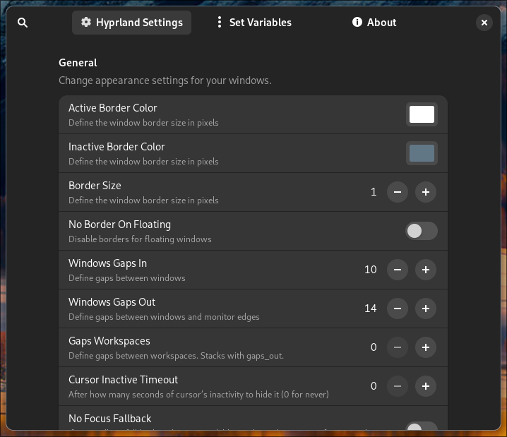

# Hypr Blizz Settings 1.0 RC1

This applications supports you to customize your Hyprland installation. You can overwrite the existing configuration with custom values without adding complex configuration files.

[](screenshots/screenshot.png)

# Installation

```

Just clone the repository manually with this command:
git clone https://github.com/RedBlizard/hypr-blizz-settings.git

See the steps below:

```
# git is required
sudo pacman -S git

# Change into your Downloads directory
cd ~/

# Clone the packages
git clone --depth 1 https://github.com/RedBlizard/hypr-blizz-settings.git

# Change into the folder
cd ~/hypr-blizz-settings

# Start the script
./install.sh
```

The script will install the app into the folder apps in your HOME directory. 

You can move the file also to another folder. In that case your have to edit the desktop file and update the Exec path to teh new loaction in .local/share/applications/ml4w-hyprland-settings.desktop

# How to use it

You can start the application from your application launcher or with your terminal from the apps folder with

```
# 1.) Change into to the apps folder
cd ~/.config/hypr/apps

# 2.) Start the app
./Hypr_Blizz_Settings-x86_64.AppImage

```

The app shows variables and current values of your running Hyprland.

You can change the values and overwrite the existing values. The change will be axecuted immediatly.

In the Set Variables tab you can see which values you have overwritten and can restore the old values be removing the entry.

To restore the changes after a later login or after a reboot, please add the following line to your hyprland.conf

```
exec = ~/.config/hypr-blizz-settings/hyprctl.sh
```

In the folder ~/.config/hypr-blizz-settings you will also find the stored values that you have set with the app.

# Dependencies

- jq
- fuse2
- gtk4
- libadwaita
